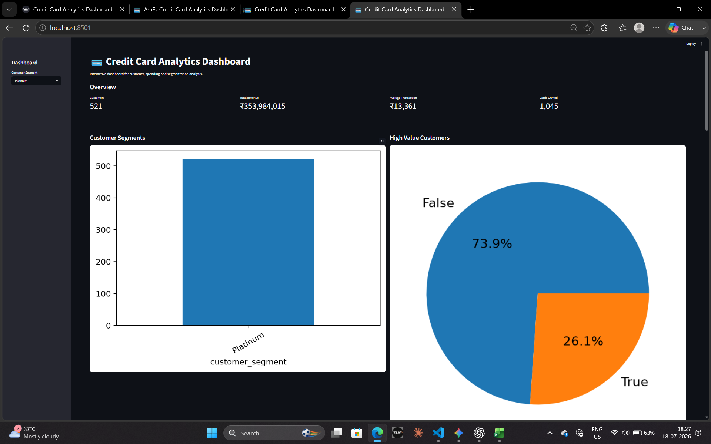
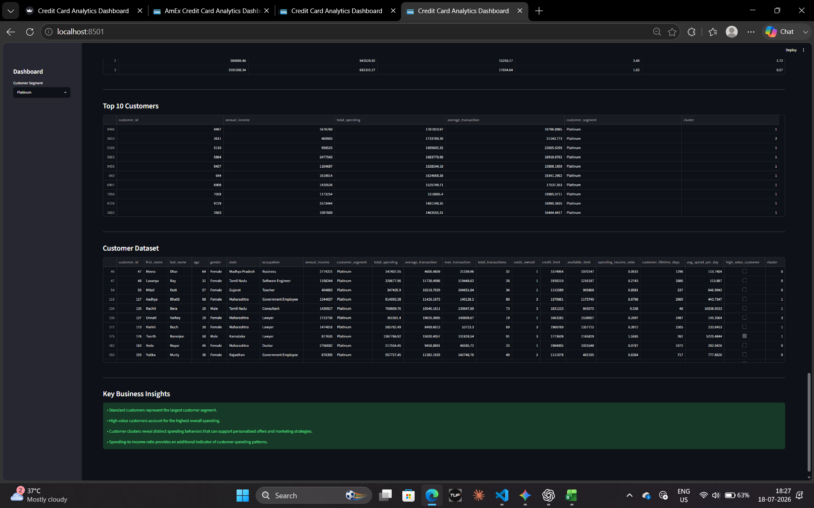
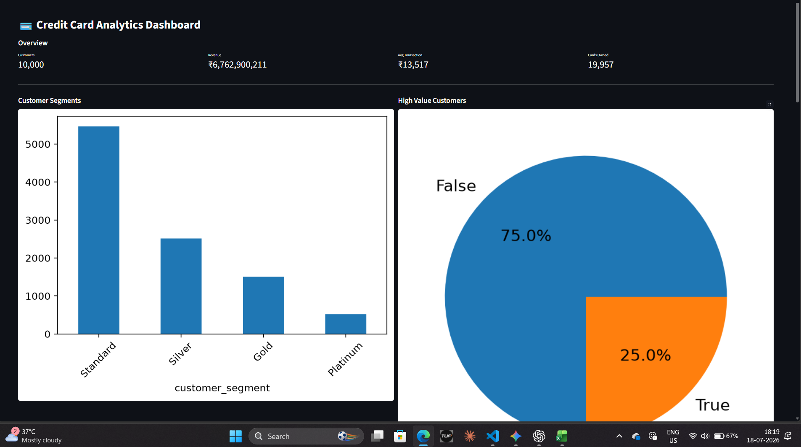

# Credit Card Analytics Dashboard

An end-to-end data analytics project that analyzes customer spending behavior, credit card usage, and customer segmentation using SQL, Python, Machine Learning, and Streamlit.

The objective of this project is to transform raw transactional data into meaningful business insights through data cleaning, SQL analysis, feature engineering, customer segmentation, and interactive visualization.

---

## Project Overview

This project follows a complete analytics workflow:

- Data Understanding
- Data Cleaning
- Data Integration
- SQL Business Analysis
- Exploratory Data Analysis (EDA)
- Feature Engineering
- Customer Segmentation using K-Means Clustering
- Interactive Dashboard Development

---

## Technologies Used

- Python
- PostgreSQL
- SQL
- Pandas
- NumPy
- Matplotlib
- Scikit-learn
- Streamlit

---

## Project Structure

```text
credit_card_analytics/

├── cleaned_data/
├── dashboard/
│   ├── app.py
│   └── requirements.txt
│
├── data/
├── database/
├── images/
├── notebooks/
├── sql/
│
├── README.md
├── LICENSE
└── .gitignore
```

---

## Workflow

### 1. Data Understanding

- Explored customer, card, merchant, and transaction datasets
- Examined data types and dataset structure
- Identified relationships between different tables

---

### 2. Data Cleaning

- Checked for missing values
- Verified data types
- Removed inconsistencies
- Exported cleaned datasets

---

### 3. Data Integration

Merged customer, card, and transaction data to build a master dataset for analysis.

---

### 4. SQL Business Analysis

Implemented several business-oriented SQL queries, including:

- Top spending customers
- Monthly revenue trends
- State-wise spending analysis
- Customer ranking
- Card usage analysis
- Common Table Expressions (CTEs)
- Window Functions
- Ranking Functions
- Aggregate Analysis

---

### 5. Exploratory Data Analysis

Performed EDA to understand customer behavior using visualizations such as:

- Customer Segment Distribution
- Revenue Distribution
- Income Distribution
- Revenue by State
- Revenue by Occupation
- Payment Method Analysis
- Monthly Revenue Trends

---

### 6. Feature Engineering

Created customer-level analytical features including:

- Total Spending
- Average Transaction Amount
- Maximum Transaction
- Total Transactions
- Cards Owned
- Spending-to-Income Ratio
- Customer Lifetime
- Average Spend Per Day
- High Value Customer Flag

---

### 7. Customer Segmentation

Applied **K-Means Clustering** to group customers with similar spending behavior.

Features used:

- Annual Income
- Total Spending
- Average Transaction
- Cards Owned
- Spending-to-Income Ratio
- Average Spend Per Day

---

### 8. Interactive Dashboard

Developed an interactive Streamlit dashboard to present business insights.

Dashboard features include:

- Overview KPIs
- Customer Segment Analysis
- High Value Customer Analysis
- Income vs Spending Visualization
- Cluster Distribution
- Cluster Summary
- Top Customers
- Customer Dataset Viewer

---

## Dashboard Preview

### Overview









---

## Key Insights

- Standard customers represent the largest customer segment.
- High-value customers contribute a significant share of the overall revenue.
- Customer segmentation reveals distinct spending patterns that can support personalized marketing strategies.
- Spending-to-income ratio provides additional insight into customer purchasing behavior.

---

## How to Run

Clone the repository

```bash
git clone https://github.com/ritikasharma-ece/credit_card_analytics.git
```

Install the required packages

```bash
pip install -r dashboard/requirements.txt
```

Run the Streamlit dashboard

```bash
streamlit run dashboard/app.py
```

---

## Learning Outcomes

This project helped strengthen practical skills in:

- SQL for business analytics
- Data cleaning and preprocessing
- Exploratory Data Analysis
- Feature Engineering
- Customer Segmentation using Machine Learning
- Dashboard development using Streamlit

---

## Future Improvements

- Merchant-level analytics
- Interactive dashboard filters
- Dashboard deployment on Streamlit Community Cloud
- Predictive analytics models
- Time-series forecasting of customer spending

---

## Made By

**Ritika Sharma**

Electronics and Communication Engineering Student

Interested in Data Analytics, Software Development, and Machine Learning.